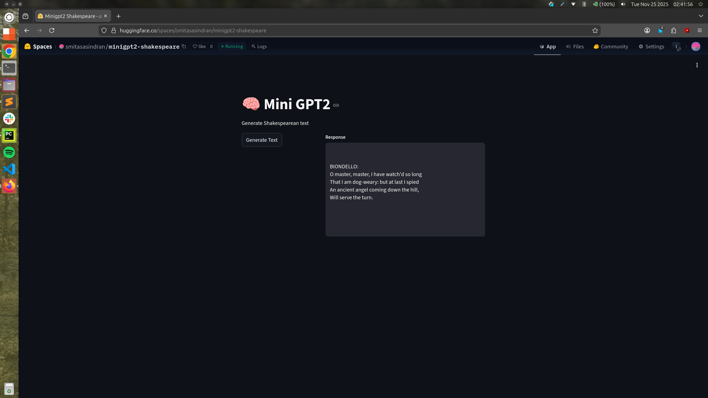
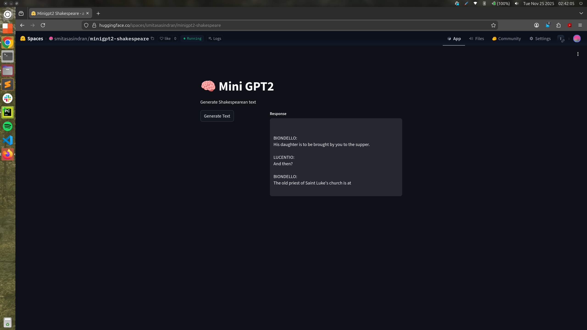

### Assignment 12 - Mini GPT2


#### 1. Requirements

1. Download the input.txt file 
2. Download code file (for reference only, you can write your own code).  
On Colab (or your computer), train a decoder only 124M or more model on this such that your loss is less than 0.099999
3. Share the GitHub link where we can see the training logs and sample outputs.
4. Share the huggingFace spaces app where we can see it running (add a screenshot on GitHub where huggingface output is visible)


#### 2. Training params

BATCH_SIZE = 8  
TOKEN_SIZE = 512  
lr = 0.0005  

Optimizer: AdamW  
Scheduler: LR with Cosine Annealing   

EPOCHS = 70  
warmup_epochs = 30  


#### 3. Training logs (Truncated)
```commandline
Epoch: 65
step1, loss: 0.003346460172906518
step81, loss: 0.002375167328864336
Epoch65, loss: 0.002375167328864336, lr: 1.9992056638433958e-05


Epoch: 66
step1, loss: 0.0032856010366231203
...
step81, loss: 0.002335085766389966
Epoch66, loss: 0.002335085766389966, lr: 1.3211399184359193e-05


Epoch: 67
step1, loss: 0.003240017220377922
...
step81, loss: 0.002306840382516384
Epoch67, loss: 0.002306840382516384, lr: 7.893704860779699e-06


Epoch: 68
step1, loss: 0.003209020709618926
...
step81, loss: 0.0022891273256391287
Epoch68, loss: 0.0022891273256391287, lr: 4.071759021513154e-06


Epoch: 69
step1, loss: 0.003190931398421526
...
step81, loss: 0.002279747975990176
Epoch69, loss: 0.002279747975990176, lr: 1.769125233584573e-06

```


#### 3. Screenshot from Huggingface spaces





